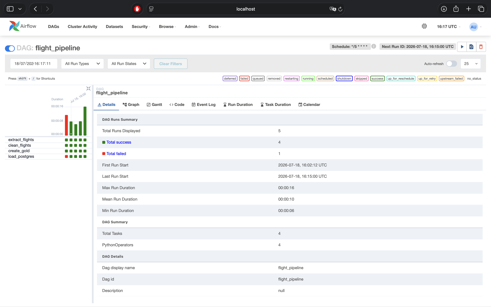
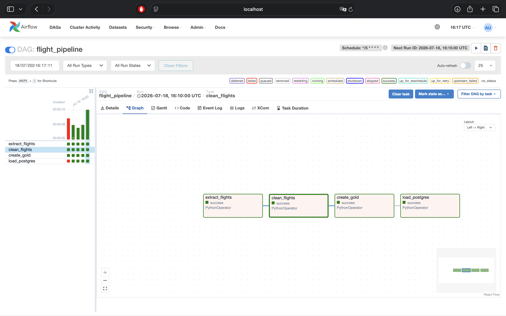
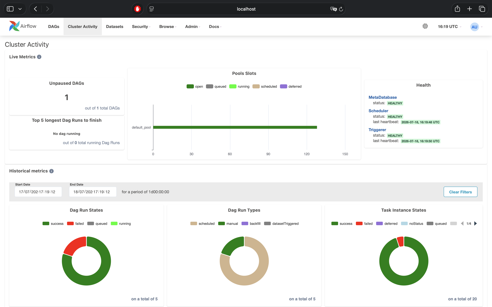
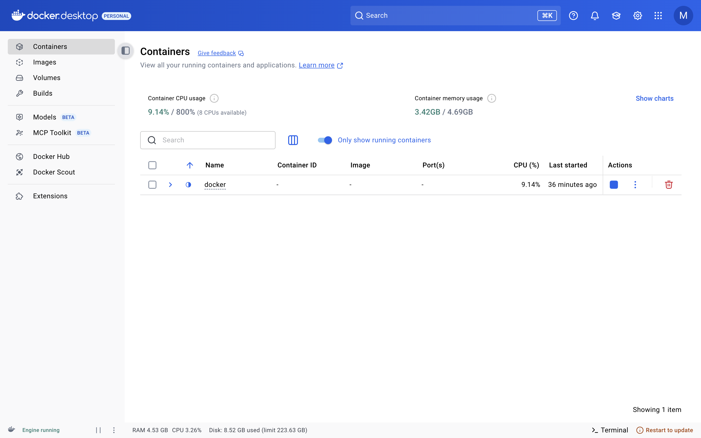
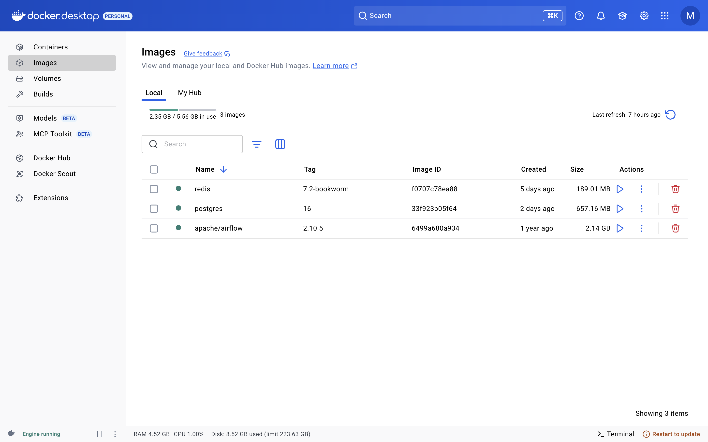
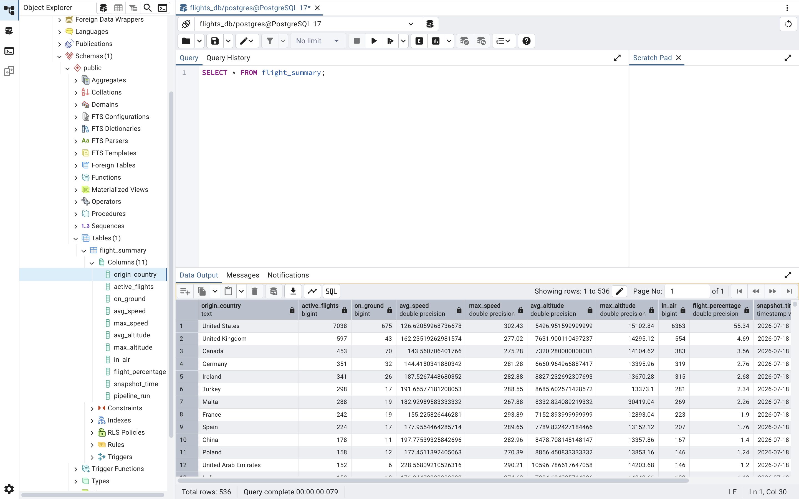

<div align="center">

# ✈️ Flight Tracking ETL Pipeline

**Real-time flight data engineering pipeline** — OpenSky Network API → Airflow → Medallion Architecture → PostgreSQL

[](https://www.python.org/)
[](https://airflow.apache.org/)
[](https://www.postgresql.org/)
[](https://www.docker.com/)
[](https://pandas.pydata.org/)

</div>

---

## 📖 Overview

This project is an end-to-end **data engineering pipeline** that ingests live aircraft state vectors from the [OpenSky Network API](https://opensky-network.org/apidoc/) every 5 minutes, processes them through a **Bronze → Silver → Gold** medallion architecture, and lands analytics-ready summaries in **PostgreSQL** — all orchestrated by **Apache Airflow** and fully containerized with **Docker**.

It's built to mirror how real production data platforms are structured: raw immutable landing zone, cleaned/validated layer, aggregated business layer, and a serving database — with every stage as an independently observable, retriable Airflow task.

## 🏗️ Architecture


**Airflow DAG dependency graph:**


Scheduled every 5 minutes (`*/5 * * * *`), fully idempotent per run, orchestrated end-to-end with zero manual intervention.

## ⚙️ Pipeline Stages

| Layer | Component | Responsibility |
|:---:|---|---|
| 🥉 **Bronze** | `src/extract/get_flights.py` | Pulls live global aircraft state vectors from OpenSky's `/states/all` endpoint and lands raw JSON, timestamped, for full historical traceability |
| 🥈 **Silver** | `src/transform/clean_flights.py` | Type casting, null/duplicate handling, timestamp normalization — produces a clean, analysis-ready parquet dataset |
| 🥇 **Gold** | `src/transform/create_gold.py` | Aggregates traffic by country: active flights, in-air vs. grounded, average/max speed & altitude, share of global traffic |
| 🐘 **Serving** | `src/load/load_postgres.py` | Loads the curated gold layer into PostgreSQL for downstream querying and BI consumption |

## 🧰 Tech Stack

<div align="center">

| Layer | Technology |
|---|---|
| Orchestration | Apache Airflow (CeleryExecutor, Redis broker) |
| Containerization | Docker & Docker Compose |
| Storage / Warehouse | PostgreSQL 16 |
| Processing | Python, pandas, PyArrow |
| Data Source | OpenSky Network REST API |
| File Format | Parquet (columnar, compressed) |

</div>

## 🚀 Getting Started

```bash
# Clone the repository
git clone https://github.com/idrees118/airflow-flight-etl-pipeline.git
cd airflow-flight-etl-pipeline

# Spin up the full Airflow + PostgreSQL + Redis stack
docker compose -f docker/docker-compose.airflow.yml up -d

# Open the Airflow UI
open http://localhost:8080   # login: admin / admin
```

Trigger the pipeline:

```bash
airflow dags trigger flight_pipeline
```

Query the results:

```sql
SELECT * FROM flight_summary
ORDER BY active_flights DESC;
```

## 📸 Live Pipeline in Action

<div align="center">

### DAG Run History


### Task Dependency Graph


### Cluster Health & Live Metrics


### Containerized Services


### Docker Images


### Curated Data in PostgreSQL


</div>

## 🗺️ Roadmap

- [ ] Migrate hardcoded connection strings to Airflow Connections / Secrets Backend
- [ ] Add dbt for gold-layer transformations and testing
- [ ] Partition historical snapshots for time-series analysis
- [ ] Add CI pipeline for DAG integrity tests
- [ ] Build a Streamlit/Grafana dashboard on top of `flight_summary`

## 📄 License

This project is open source and available under the [MIT License](LICENSE).

---

<div align="center">
Built with ❤️ using Airflow, Docker, and PostgreSQL
</div>
